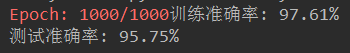
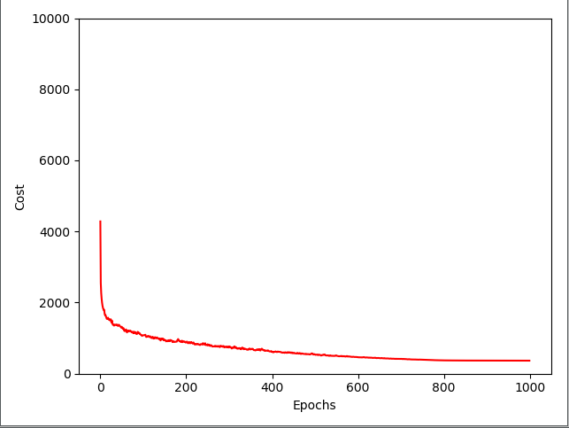
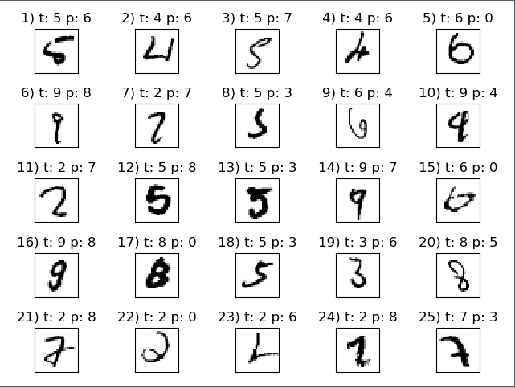
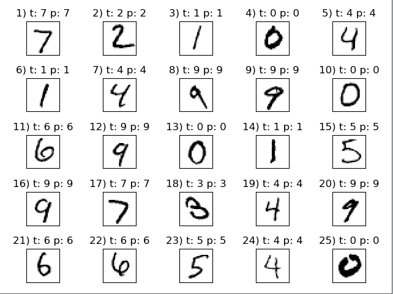

# Neural-Network
Python实现神经网络算法识别手写数字集

MNIST数据集基于美国国家标准与技术研究院的两个数据集构建而成。
训练集中包含250个人的手写数字，其中50%是高中生，50%来自人口调查局。
每个训练集的数字图片像素为28x28。
MNIST数据集可通过 [下载链接](http://yann.lecun.com/exdb/mnist/) 下载，它包含以下内容：
* 训练集图像：train-images-idx3-ubyte.gz，包含60000个样本
* 训练集类标：train-labels-idx1-ubyte.gz，包含60000个类标
* 测试集图像：t10k-images-idx3-ubyte.gz，包含10000个样本
* 测试集类标：t10k-labels-idx1-ubyte.gz，包含10000个类标

关于神经网络算法的详解太过复杂，本人水平有限便不再描述，我这里只给出我们两人的代码。若想了解详情请移步谷歌或者百度。

代码文件为load_mnist.py  
**代码测试结果：** 
  
代价函数图像： 
 
 
测试错误样本： 
 
 
测试正确样本： 
 
